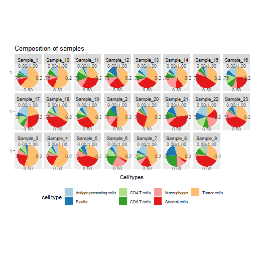
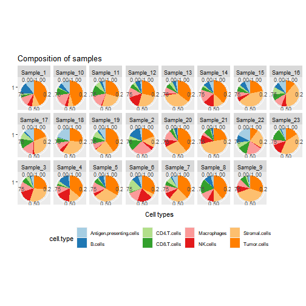
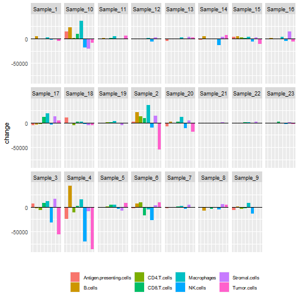
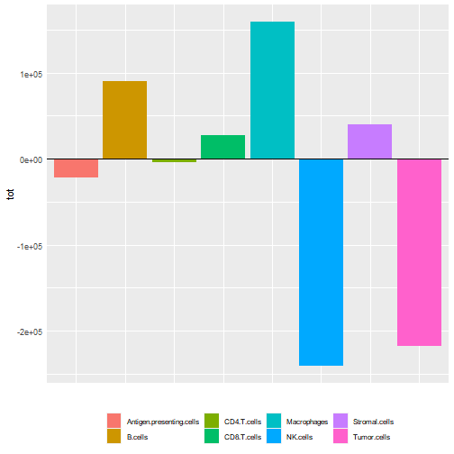
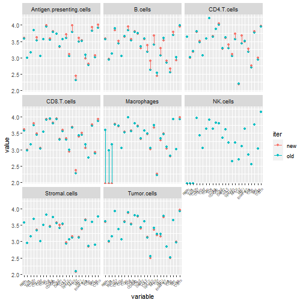

# Report


## Cell type compositions


### Results from the new iteration 


### Results from the old iteration 


### Differences in cell type amounts between iterations 


## Gating analysis


```
## Warning in index_plots(list.new, list.old): No gates for cell type NK.cells
```


### Marker index 

 The average expression of certain markers in all the samples of each iteration in different cell types
### Gate index 

 The average expression of each cell type's positive markers minus the average of their negative markers of each iteration          index                cell.type iter pairs
1   0.410812924 Antigen.presenting.cells  new     1
2   0.342225992 Antigen.presenting.cells  old     1
3   0.022804204                  B.cells  new     2
4  -0.149399919                  B.cells  old     2
5   0.597110366              CD4.T.cells  new     3
6   0.596723720              CD4.T.cells  old     3
7   0.398947180              CD8.T.cells  new     4
8   0.427232904              CD8.T.cells  old     4
9   0.313470604              Macrophages  new     5
10  0.318046023              Macrophages  old     5
11 -0.001915138            Stromal.cells  new     6
12 -0.025172347            Stromal.cells  old     6
13  0.268302294              Tumor.cells  new     7
14  0.287487303              Tumor.cells  old     7

## Marker expression

### Heatmaps


```
## Error in (function (classes, fdef, mtable) : unable to find an inherited method for function 'draw' for signature '"list"'
```
