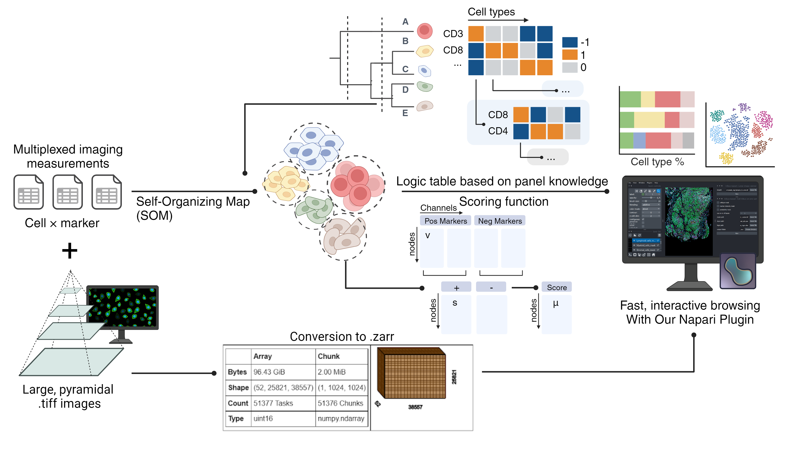

# Tribus: **Semi-automated panel-informed discovery of cell identities and phenotypes from multiplexed imaging and proteomic data**

## Installation

```
   cd tribus/
   python setup.py develop
   pip install  -e ./
```

Or clone from GitHub repository.

For setting up conda environment, please use ``tribus_environment.yml``.

## Usage instructions

### Tribus for cell type classification

Example for running the labeling module through terminal:

```
    cd ../cool_project_name
    tribus classify -i input_data/ -l gate_logic.xlsx -o tribus_results
```

We also recommend using jupyter notebook for active interactions. Please see example here: (coming soon)

Example datasets and more scripts could be found on Synapse: (link coming soon)

### Napari plugin for Tribus

    TODO instructions to open the napari notebook.

## Folder structure

Example of my test folder after using the `tribus classify` command:
the input data and gate logic could be anywhere else in the computer as long as we put the correct path.

```
    cool_project_name/
    |_ date_logic.xlsx
    |_ input_data/
    |   |_ each file here belongs to a separate slide (windsord-normalization is done by slide)
    |_ tribus_results/
        |_ 2021-11-02_13-40/
        |    |_ gates_2021-11-02_13-40.xlsx
        |    |_ labels_2021-11-02_13-40.csv
        |_ 2021-11-02_13-12/
            |_ gates_2021-11-02_13-12.xlsx
            |_ labels_2021-11-02_13-12.csv
```

## Citing Tribus

If you used Tribus in your research, please consider cite us: (DOI coming soon)
