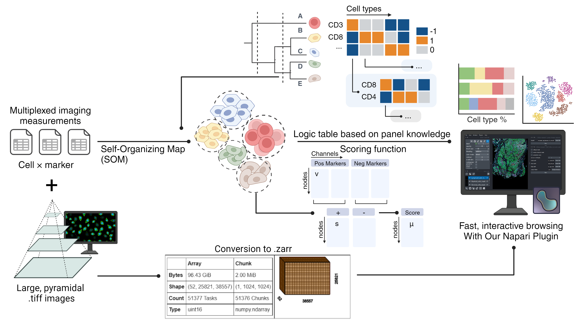
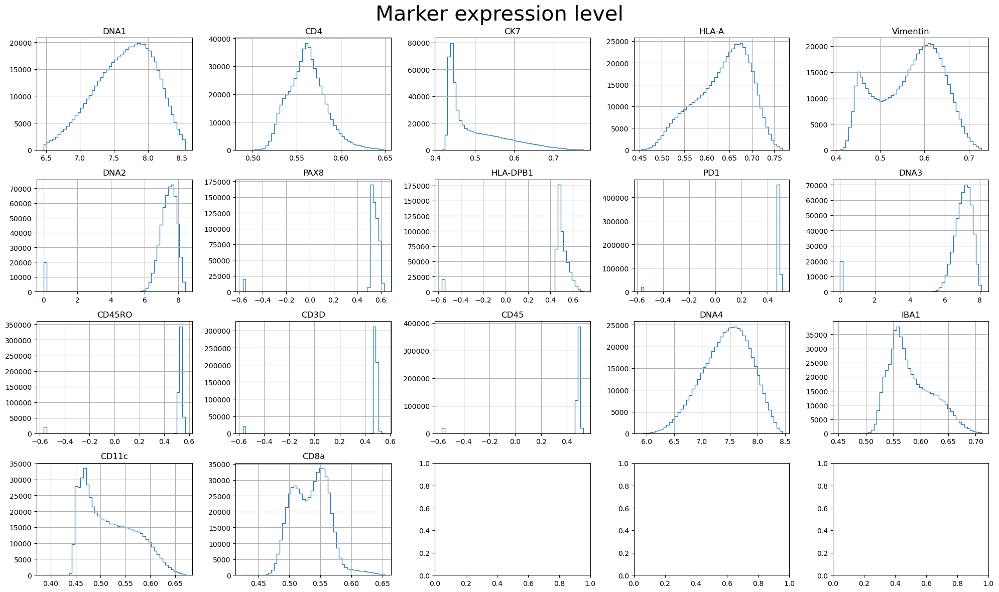
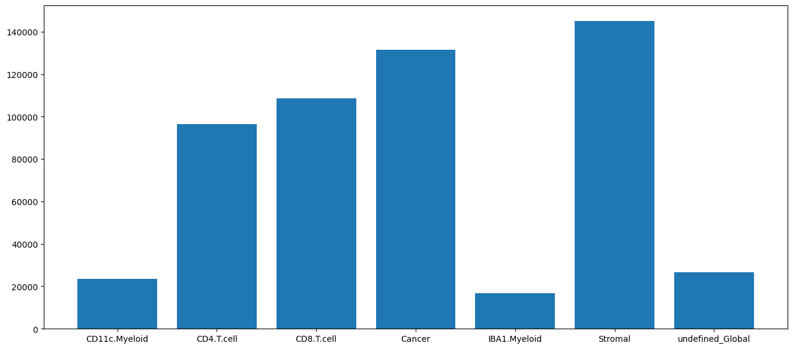
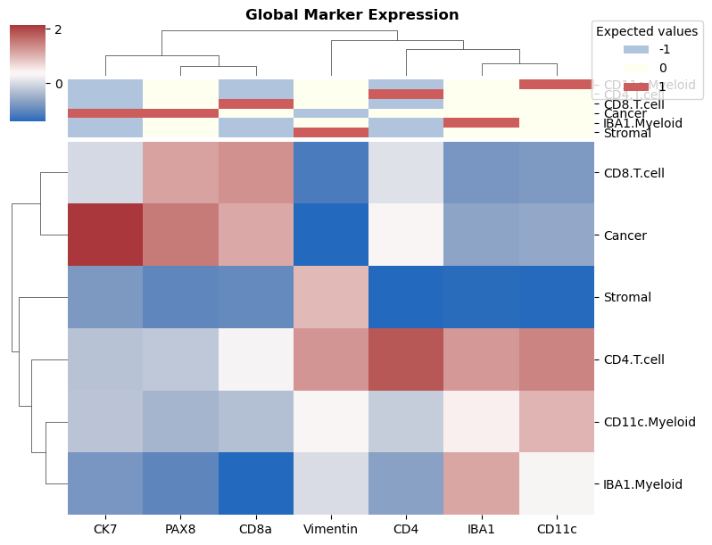
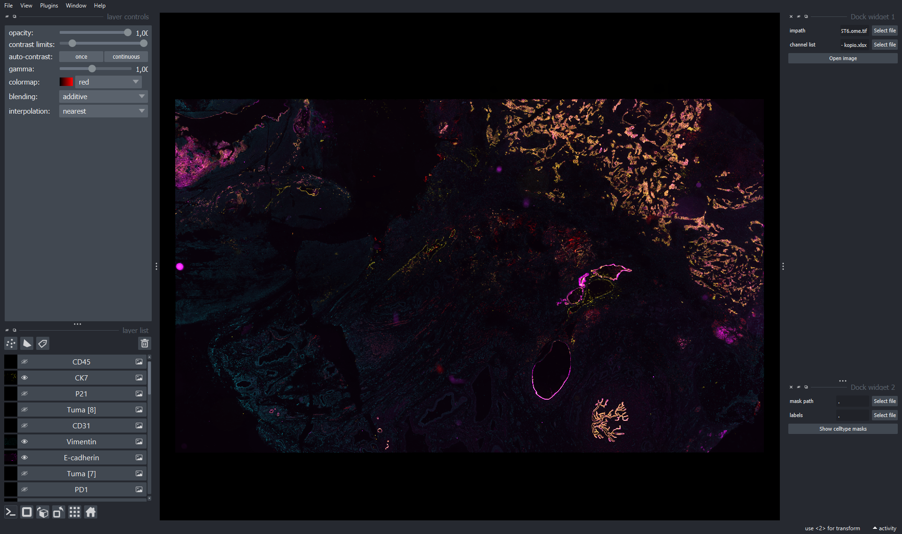
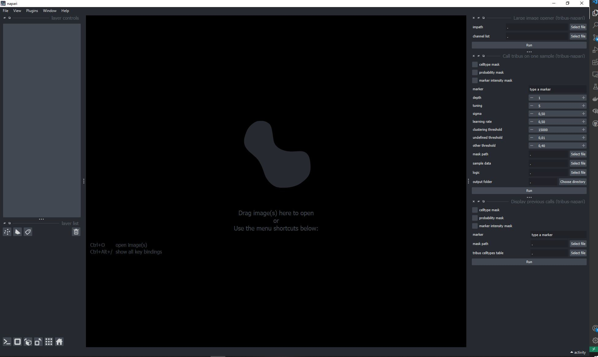

# Tribus: **Semi-automated panel-informed discovery of cell identities and phenotypes from multiplexed imaging and proteomic data**

## Installation

* For setting up conda environment, please use ``tribus_environment.yml`` to install all the dependencies. Run in conda prompt window:

```
conda env create --file=tribus_environment.yml
# This environment allows you to run Tribus and repeat all the analyzes in the manuscript. 
```

* Clone from GitHub repository.
* Then, run the following command in your conda environment of Tribus:

```
conda activate tribus

cd tribus/
python setup.py develop
pip install  -e ./
```

Now you are ready to use Tribus!

## Usage instructions

### Tribus for cell type classification

* We provide a jupyter notebook example. Please see the example `Tribus_run.ipynb`.
* Datasets included in the manuscript and the corresponding scripts could be downloaded from Synapse with ID: `syn53754523`.

#### Input dataset

* Tribus requires an input dataset following the template below.
* No need to remove columns that are unused for cell type calling, Tribus will only read in the columns that you specified in the logic table.
* You can even include morphological features in the logic table, such as eccentricity or cell area, as long as it is helpful for the cell type calling. Those might be useful for identifying certain cell types (e.g. (1) a cell with eccentricity close to 0, which means roundness, is less likely to be a fibroblast, (2) tumor cells tend to have larger cell area). However, those features are more ambiguous for cell type annotation compared with typical marker expression. Thus, please be careful if you want to include those features. 

| CellID | Marker 1 | Marker 2 | ... | Marker N | **Eccentricity** | Cell Area |
| ------ | -------- | -------- | --- | -------- | ---------------------- | --------- |
| 1      |          |          | ... |          |                        |           |
| 2      |          |          | ... |          |                        |           |

#### Logic table

Here is an example of a 1-level logic table. The logic table is designed based on the marker panel following some rules: 

* If a marker should be present in a specific cell type, the value in the logic table needs to be assigned by 1. If a marker is supposed to be absent in a specific cell type, then the value in the logic table should be assigned -1. For neutral or unknown markers, 0 should be assigned.
* You can contain a marker will all 0, if you want to include this marker but are uncertain about the presence/absent of the marker.
* One cell type should have at least one positive marker among the whole logic table.

| Marker   | Cancer | Stromal | CD.4.Tcell | CD8.T.cell | CD11c.Myeloid | IBA1.Myeloid |
| -------- | ------ | ------- | ---------- | ---------- | ------------- | ------------ |
| CK7      | 1      | -1      | -1         | -1         | -1            | -1           |
| PAX8     | 1      | 0       | 0          | 0          | 0             | 0            |
| Vimentin | -1     | 1       | 0          | 0          | 0             | 0            |
| CD4      | 0      | -1      | 1          | -1         | -1            | -1           |
| CD8a     | 0      | -1      | -1         | 1          | -1            | -1           |
| IBA1     | 0      | 0       | 0          | 0          | 0             | 1            |
| CD11c    | 0      | 0       | 0          | 0          | 1             | 0            |

#### Tribus Parameter

```
# set random seed to ensure reproducing
depth = 1
labels, scores = tribus.run_tribus(np.arcsinh(sample_data[cols]/5.0), logic, depth=depth, normalization=z_score, 
                            tuning=0, sigma=1, learning_rate=1, 
                            clustering_threshold=100, undefined_threshold=0.0005, other_threshold=0.4, random_state=42)
```

* `depth`: levels of the logic table. You can set depth smaller than the levels you have - in this case, Tribus will stop at the level as you wish.
* `normalization`: z_score or None
* `tuning`: When you set a number here, Tribus will run hyperparameter optimization with [number] rounds of repeat for `sigma` and `learning rate`. If you set 0, Tribus will not do hyperparameter optimization. We recommend you use hyperparameter optimization if you are not satisfied with the result and don't know how to adjust `sigma` and `learning rate`.
* `sigma`: is the radius of the different neighbors in the SOM. The default value for this is 1.0.
* `learning_rate`: determines how much weights are adjusted during each iteration.
* `clustering_threshold`: If the number of cells is smaller than the threshold you set here, Tribus will skip the SOM clustering and calculate the scoring function at the single-cell level.
* `undefined_threshold`: if the difference between the maximum and second maximum score is smaller than the threshold, the cluster will be labeled as "undefined_[level_name]".
* `other_threshold`: if the maximum score of a cluster is smaller than the threshold, the cluster will be labeled as the "other"
* `random_state`: None or any random seeds you like. To ensure the reproduction of your result :)

#### Tribus visualization

Tribus provides some visualization functions. You can find examples in example `Tribus_run.ipynb` in this repository.

* `marker_expression`: allows you to visualize the marker expression. You can evaluate the quality of the marker by checking this plot. 
* `cell_type_distribution`: Allows you to check the distribution of the cell types and evaluate the quality of the cell type calling result. 
* `heatmap_for_median_expression`: Draw a heatmap that allows you to check the marker expression in each cell type. 

#### Napari plugin for fast user interaction

We provide ` Fast_masking_v2_colors_fixed.ipynb` to run a fast Napari plugin. Run the chunks in the notebook and a napari window will pop out. You can check the quality of cell type calling and adjust the logic table correspondingly. 



We are also providing `Tribus_napari_full_widget.ipynb` for users to run Tribus directly in a Napari window! Here is a screenshot of the full interface. In order to use it, run the chunks in the notebook. 



## Folder structure

Here is an example of folder structure:
P.S. The input data and gate logic could be anywhere else in the computer as long as we specify the correct path when running Tribus.

```
    cool_project_name/
    |_ data_logic.xlsx
    |_ input_data/
    |   |_ <data>.csv
    |_ output_data/
        |_ sample_name/
        |    |_ <heatmap>.png
        |    |_ <barplot>.png
        |    |_ ...
        |    |_ labels.csv
        |_ sample_name/
        |    |_ <heatmap>.png
        |    |_ <barplot>.png
        |    |_ ...
        |    |_ labels.csv
```

## Citing Tribus

If you used Tribus in your research, please consider citing us: [https://doi.org/10.1101/2024.03.13.584767](https://doi.org/10.1101/2024.03.13.584767)
